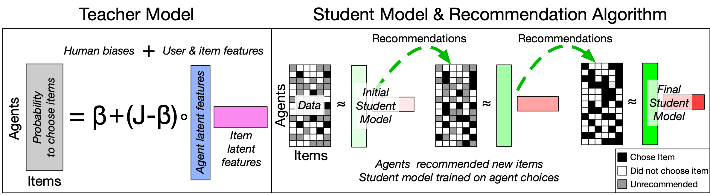

# Recommendation System Simulations

</img> 

## Outline of simulation
- *Teacher model* (left panel) tells agents the probability to choose any item recommended to them (Bernoulli trial for each choice)
- *Student model* (right panel) estimates the probability agents will choose any item (including items not yet recommended)
- Recommendation algorithm (right panel) recommends items to agents. There are 4 strategies
    - Greedy: recommend new items to each agent that are most likely to be chosen 
    - Epsilon-Greedy: 10% probability: recommend items at random, 90% probability: recommend new items to each agent that are most likely to be chosen 
    - Random: Recommend items at random
    - Oracle: Idealized case where student model is exactly the teacher model. This strategy shows upper bounds in recommendation algorithm performance.
    
    
## Required libraries:
- [pandas](https://pypi.org/project/pandas/): Tested on 1.1.5
- [numpy](https://numpy.org/install/): Tested on 1.19.5
- [tensorflow](https://www.tensorflow.org/api_docs/python/tf): Tested on 2.6.1
- [scipy](https://scipy.org/install/): Tested on 1.5.4

## To run
- Modify required parameters in AlgorithmicBias_Github.py
- Typical simulation can be run with:
$ python AlgorithmicBias_Github.py 

## What this code does
Output are all parameters for model simulations and time-varying features of model, including item popularity, which can be used to calculate Gini coefficient, cumulative item popularity, etc.

## Parameters
### main()
- *n*: number of agents (default = 4000)
- *m*: number of items (default = 200)
- *k*: Teacher model latent dimensions (default = 4)
- *ID*: Random seed to create unique teacher model. Set to an int number: seed number, else if set to None: new seed created at each realization
- *eps*: Epsilon greedy parameter. 0.0: greedy strategy, 0.1: default epsilon-greedy strategy, 1.0: random strategy
- *seed*: Seed to initial conditions (what user-item pairs are initially 1 or 0 for initial student model training). Used in conjunction with ID. If set to None, new seed made each realization
- *uniform_beta*: Whether elements of the Beta matrix for the Teacher model are all the same (uniform_beta = False) or IID values between 0 and 1 (uniform_beta = True)
- *GT*: If true, we use the oracle strategy (idealized upper bound on performance) 
- *realization*: The unique number associated with a given realization of the simulation
- **(Legacy):** rand_rec:  If true, we the model runs the random strategy. This is exactly the same as eps = 1.0 and so can be set to False 

### collect_AB_sims
- *r*: number of items recommended before the student model is retrained
- *fract_available*: initial fraction of data used to train the student model (default = 0.001)
- *embeddings*: latent features in student model (we output both 2 and 5 to test robustness). This parameter is "k'" in the paper.

## Output
File name lists basic parameters for code, including whether uniform_beta = True (feature of teacher model)
Pickle file with the following keys:
- 'P': Teacher model P
- 'Q': Teacher model Q
- 'n': Number of agents 
- 'm': Number of items
- 'k': Latent features in teacher model
- 'beta': Beta scalar parameter for teacher model. If uniform_beta = True, this is always 0.0. 
- 'r': Number of items recommended before model is retrained
- 'fract_available': Initial fraction of data student model is trained on
- 'epsilon': Parameter for epsilon-greedy strategy (epsilon = 0.0 for greedy strategy, 0.1 for epsilon greedy strategy, and 1.0 for random strategy)
- 'embeddings': Latent features in student model ("k'" in paper; default = 5)
- 'realization': Always 1. Modifications to code can allow multiple realizations to be saved in 1 .pkl file
- 'sim_data': data recorded at each timestep
- 'final_R_views': Final user-item matrix (R^{data} in the paper)
- 'final_U': Final P matrix for student model
- 'final_V': Final Q^T matrix for student model
- 'gt_U': Teacher model P (legacy)
- 'gt_V': Teacher model Q^T (legacy)

### sim_data 
This key contains several features for each timestep (listed in order):

- Simulation timestep (values from 1 to m)
- Minimum valence error (Brier score)
- Number of user-item pairs not recommended
- Popularity of each item (how many times they were chosen). Used to find mean item popularity, Gini coefficient **(statistics for Figs. 2, 4, 5b-c)**
- Two statistics:
    - **(Legacy):** MSE error between student and teacher model probabilities
    - Brier score between trained student model and all collected user-item pairs **(statistic for Fig. 3, 5a)**
- **(Legacy):** [the item the student model predicts each user is most likely to choose, the rank the student model gives to the ground truth most preferred item for each agent]
- **(Legacy):** Correlations between student model-predicted popular items or users who pick many items and the teacher model ground truth

## Please cite as
Keith Burghardt, Kristina Lerman. Emergent Instabilities in Algorithmic Feedback Loops. arXiv preprint: arXiv:2201.07203 (2022)

>@article{Burghardt2022,
>author={Keith Burghardt and Kristina Lerman},
>title={Emergent Instabilities in Algorithmic Feedback Loops},
>journal={arXiv preprint: arXiv:2201.07203},
>year={2022}
>}
